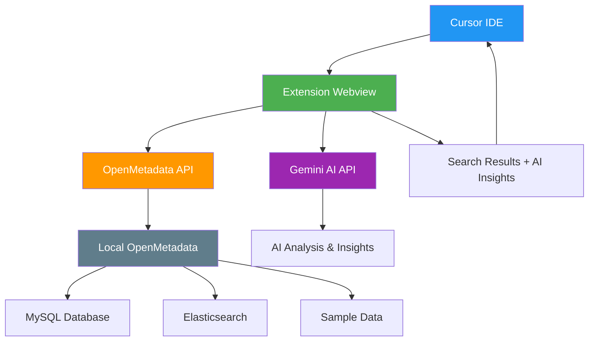

# Building an AI-Powered Data Catalog Extension for Cursor IDE

*Bringing OpenMetadata Intelligence Directly into Your Development Environment*

## Motivation: The Context Switching Problem

Modern data development workflows suffer from a critical productivity killer: **context switching**. Developers constantly jump between their IDE, data catalog interfaces, documentation portals, and various metadata tools to understand the data they're working with.

> **📊 TODO: Add statistics/survey data about context switching impact on developer productivity**
> 
> Research shows that context switching can reduce productivity by up to X%, with developers taking an average of Y minutes to refocus after each interruption.

This fragmented experience creates several challenges:

- **Cognitive Load**: Remembering information across multiple interfaces
- **Time Waste**: Repeatedly switching between applications  
- **Workflow Disruption**: Breaking the development flow state
- **Knowledge Gaps**: Missing connections between code and data context

## The Data Development Journey

A significant portion of the data development lifecycle involves **getting the right data**. Data engineers and analysts spend considerable time:

- 🔍 **Discovering datasets** - Finding tables that contain the information they need
- 📋 **Understanding schemas** - Exploring column definitions, data types, and constraints  
- 🔗 **Tracing lineage** - Following data transformations and dependencies
- 📊 **Assessing quality** - Checking data freshness, completeness, and reliability
- 📖 **Reading documentation** - Understanding business context and usage patterns

Currently, this exploration happens outside the development environment, creating friction and breaking the coding flow.

## Solution: Bringing Metadata into the IDE

This project demonstrates how to bring comprehensive data catalog functionality directly into the development environment using:

- **[OpenMetadata](https://open-metadata.org/)** - An industry-standard, open-source data catalog platform
- **Gemini AI** - For intelligent, conversational data exploration
- **Cursor IDE** - The most popular AI-assisted development environment

### Why OpenMetadata?

OpenMetadata provides:
- ✅ **Industry Standard**: Widely adopted open-source data catalog
- ✅ **Comprehensive Metadata**: Tables, columns, lineage, quality metrics
- ✅ **Rich APIs**: RESTful endpoints for programmatic access
- ✅ **Sample Data**: Realistic fake datasets for development

### Why Gemini AI?

The integration with Gemini AI serves multiple purposes:
- 🤖 **Conversational Interface**: Matches the chat-based interaction developers expect in Cursor
- 💬 **Natural Language Queries**: Ask questions like "show me customer tables" instead of complex filters
- 🧠 **Intelligent Analysis**: Provides insights, recommendations, and data quality observations
- 💰 **Free Tier**: Google AI Studio offers generous free quotas for development

## Technical Implementation

### Architecture Overview

The solution consists of three main components:

1. **Local OpenMetadata Deployment** - Complete data catalog infrastructure
2. **Cursor Extension** - VS Code extension with React-based webview
3. **AI Integration** - Gemini API for intelligent data analysis

### OpenMetadata Local Setup

Following the [official OpenMetadata Docker deployment guide](https://docs.open-metadata.org/latest/quick-start/local-docker-deployment), we deploy a complete data catalog stack:

#### Infrastructure Components

- **MySQL Database** - Stores metadata, user accounts, and configurations
- **Elasticsearch** - Powers fast search across all metadata
- **OpenMetadata Server** - Core API and web interface  
- **Airflow** - Orchestrates data ingestion and quality workflows

#### Sample Data

The deployment includes realistic fake datasets representing typical enterprise scenarios:
- Customer information tables
- Order and transaction data
- Product catalogs
- User activity logs
- Sales and revenue metrics

#### Setup Process

```bash
# 1. Create directory
mkdir openmetadata-docker
cd openmetadata-docker

# 2. Download docker-compose file
curl -L https://github.com/open-metadata/OpenMetadata/releases/latest/download/docker-compose.yml -o docker-compose.yml

# 3. Start services
docker compose up -d

# 4. Access OpenMetadata at http://localhost:8585
# Default credentials: admin@open-metadata.org / admin
```

**System Requirements:**
- Docker with at least 6GB memory and 4 vCPUs allocated
- Docker Compose v2.1.1 or greater

The setup process is straightforward and provides a complete data catalog environment with pre-loaded sample data, making it ideal for development and testing.


*Screenshots showing the local OpenMetadata deployment and sample data*

### Cursor Extension Development

[Cursor](https://cursor.com/) has emerged as the leading IDE for AI-assisted development, with developers accustomed to conversational interfaces for coding assistance. Our extension leverages this familiarity by providing:

- **Chat-like Interface** - Natural language queries for data exploration
- **Contextual Results** - Rich metadata display with AI-powered insights  
- **Integrated Workflow** - No need to leave the IDE for data discovery

### VS Code Extension Fundamentals

Building a VS Code extension requires understanding the core architecture and contribution model. Based on the [official VS Code Extension API documentation](https://code.visualstudio.com/api/extension-guides/overview), extensions are structured around several key components:

#### Core Extension Structure

**`package.json`** - The extension manifest defines:
- Extension metadata (name, version, description)
- **Contribution Points** - How the extension extends VS Code functionality
- **Activation Events** - When the extension should be loaded
- Dependencies and build scripts

**Extension Entry Point** - The main TypeScript/JavaScript file that:
- Registers providers and commands when activated
- Manages extension lifecycle and cleanup
- Handles communication between VS Code and extension features

#### Strategic UI Positioning: The Terminal Panel

For our data catalog extension, **positioning next to the terminal** is strategically important because:

- 🔧 **High Developer Traffic** - Terminal is one of the most frequently accessed areas
- 📍 **Bottom Panel Real Estate** - Wide horizontal space ideal for data tables and results
- 🔄 **Workflow Integration** - Developers often switch between terminal commands and data exploration
- 👀 **Persistent Visibility** - Stays accessible while coding in the main editor

#### Implementation Approach

The key to panel positioning lies in VS Code's **view containers** system:

```json
"contributes": {
  "viewsContainers": {
    "panel": [{
      "id": "openmetadataPanel",
      "title": "OpenMetadata AI", 
      "icon": "$(database)"
    }]
  },
  "views": {
    "openmetadataPanel": [{
      "id": "openmetadataExplorer",
      "name": "Explorer",
      "type": "webview"
    }]
  }
}
```

This configuration creates a new panel container that appears alongside Terminal, Problems, and Debug Console tabs. The **webview type** enables rich React-based UI rendering within the VS Code environment.

**Webviews** provide the flexibility needed for our data exploration interface, supporting:
- Custom HTML/CSS/JavaScript rendering
- Two-way communication with the extension backend
- Integration with VS Code's theming system
- Rich data visualization capabilities

### System Architecture

The extension architecture creates a seamless bridge between the IDE and data catalog:



### Proposal Summary

The core proposal is to create a **Cursor extension** that:

1. **Queries OpenMetadata APIs** to retrieve comprehensive metadata about tables, columns, and relationships
2. **Leverages Gemini AI** to analyze and organize the metadata into conversational, actionable insights
3. **Presents results** in a familiar chat-like interface directly within the IDE
4. **Eliminates context switching** by bringing data catalog functionality into the development environment

This approach combines the robust metadata management capabilities of OpenMetadata with the conversational AI experience that Cursor developers expect, creating a seamless data exploration workflow.

---

*To be continued with implementation details, user experience walkthrough, and results...*