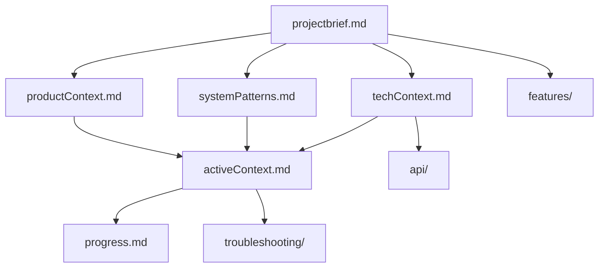

# Memory Bank - OpenMetadata AI Explorer

## Overview
This Memory Bank contains comprehensive documentation for the OpenMetadata AI Explorer VS Code extension project. All files are in Markdown format and build upon each other in a clear hierarchy.

## File Hierarchy & Dependencies

## Core Files (Required Reading)

### 1. [projectbrief.md](./projectbrief.md) 🏗️
**Foundation document - READ FIRST**
- Project overview and core requirements
- Success criteria and constraints
- Repository information and project structure
- Source of truth for project scope

### 2. [productContext.md](./productContext.md) 💡
**Why this project exists**
- Problem statement and solution vision
- User experience goals and target audience
- Technology choice rationale
- Value proposition for data engineers

### 3. [systemPatterns.md](./systemPatterns.md) 🏛️
**Architecture and design patterns**
- Two-tier architecture (Extension Host + Webview)
- Key design patterns and data flows
- Performance and security patterns
- Component relationships

### 4. [techContext.md](./techContext.md) ⚙️
**Technology stack and setup**
- Dependencies and external APIs
- Development environment setup
- Build system configuration
- Technical constraints and limitations

### 5. [activeContext.md](./activeContext.md) 🎯
**Current state and immediate focus**
- Recent changes and fixes applied
- Current feature status and testing results
- Active decisions and next steps
- Last session context and pending work

### 6. [progress.md](./progress.md) 📊
**What works and what's left**
- Completed features and functionality
- Known issues and their resolution status
- Testing status and deployment readiness
- Success metrics achievement

## Detailed Context

### Features Documentation
- **[features/lineage-visualization.md](./features/lineage-visualization.md)**: Complete lineage feature documentation
  - User experience and technical implementation
  - ReactFlow and ELK integration details
  - API flow and error handling
  - Performance considerations and future enhancements

### API Integration
- **[api/openmetadata-integration.md](./api/openmetadata-integration.md)**: OpenMetadata REST API integration
  - Authentication setup and endpoint documentation
  - Search and lineage API details
  - Error handling and testing approaches
- **[api/gemini-integration.md](./api/gemini-integration.md)**: Gemini AI API integration
  - Configuration and prompt engineering
  - Response handling and performance considerations
  - Use cases and best practices

### Troubleshooting
- **[troubleshooting/common-issues.md](./troubleshooting/common-issues.md)**: Comprehensive issue resolution
  - Extension loading problems and fixes
  - API integration issues and solutions
  - Build and development troubleshooting
  - Performance and configuration problems

## Project Status Summary

### Current State (Latest Session)
- ✅ **Core Extension**: Working with search, AI insights, and lineage
- ✅ **Major Issues Fixed**: VS Code API errors, lineage crashes resolved
- 🔄 **Testing Phase**: Awaiting user validation of lineage functionality
- 📝 **Documentation**: Complete technical documentation in memory bank

### Key Achievements
1. **Extension Positioning**: Successfully loads in bottom panel next to terminal
2. **Natural Language Search**: AI-powered search with conversational interface
3. **Lineage Visualization**: Interactive ReactFlow graphs with ELK layout
4. **Robust Error Handling**: Graceful fallbacks and user feedback
5. **VS Code Integration**: Full theming and native extension experience

### Technical Stack
- **Frontend**: React 18 + TypeScript in VS Code webview
- **Visualization**: ReactFlow + ELK layout engine  
- **APIs**: OpenMetadata REST API + Gemini 2.0 AI
- **Build**: Webpack 5 with TypeScript compilation
- **Architecture**: Message-passing between extension host and webview

## How to Use This Memory Bank

### For Continuing Development
1. **Start with `projectbrief.md`** - understand the core mission
2. **Review `activeContext.md`** - get current state and immediate priorities
3. **Check `progress.md`** - see what's working and what needs attention
4. **Reference detailed docs** as needed for specific features/APIs

### For Troubleshooting
1. **Check `troubleshooting/common-issues.md`** for specific problems
2. **Review `activeContext.md`** for recent fixes and known state
3. **Reference API docs** for integration-specific issues

### For Understanding Architecture
1. **Read `systemPatterns.md`** for high-level architecture
2. **Review `techContext.md`** for implementation details
3. **Check feature docs** for specific component details

## Repository Context
- **GitHub**: https://github.com/hugozanini/open-metadata-cursor-extension.git
- **Main Branch**: `main` (stable)
- **Feature Branch**: `feature/lineage-visualization` (active development)
- **Local Path**: `/Users/hugo.zanini/Documents/projects/gde/vs-code-extension/open-metadata-cursor-extension`

## Development Workflow
1. **F5** to launch Extension Development Host
2. **Search functionality** for testing data discovery
3. **Lineage buttons** on table cards for graph visualization
4. **Console debugging** in both extension host and webview contexts
5. **Settings configuration** for API keys and URLs

## Success Criteria Status
- ✅ Extension loads in correct panel position
- ✅ Natural language search working with AI insights
- ✅ Interactive lineage visualization functional
- ✅ Authentication and error handling robust
- ✅ Complete technical documentation
- 🔄 User testing and final validation pending

This Memory Bank provides complete context for continuing development, troubleshooting issues, and understanding the full scope of the OpenMetadata AI Explorer project.